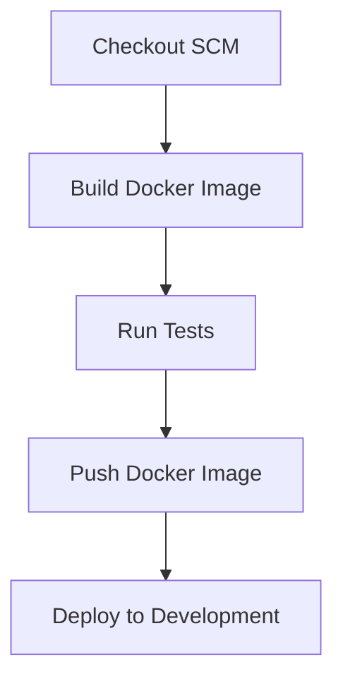

# Handoff for Alex 0.0.2: Docker Container for Next.js App with Jenkins Pipeline

We are working on setting up a Jenkins pipeline to build a Docker container for a Next.js application. The goal is to start with the basics and gradually build up complexity to speed up the development process.

## Pipeline Structure

## Standard Operating Procedure (SOP)

1. Start with a basic Jenkinsfile:
   - Use the 'main' branch instead of 'master'
   - Configure the pipeline to build a Next.js app (not Python)
   - Use a Node.js Docker image as the base (e.g., node:18)

2. Create a Dockerfile in the project root:
   - Use a Node.js base image
   - Copy the application files
   - Install dependencies using pnpm
   - Build the Next.js application
   - Set the command to start the Next.js server

3. Modify the Jenkinsfile to:
   - Check out the code from the main branch
   - Build the Docker image
   - Run basic tests (e.g., pnpm run test)
   - Push the Docker image to a registry (if available)
   - Deploy the container to a development environment

4. Keep the initial setup simple:
   - Focus on getting the basic pipeline working
   - Ensure the Docker container can build and run the Next.js app
   - Add more complex tests and stages later

5. Once the basic pipeline is working:
   - Gradually add more sophisticated tests
   - Implement staging and production deployment stages
   - Add security scans and performance tests as needed

Remember, the key is to start simple and build up complexity over time. Get the basic Docker container building and running the Next.js app first, then expand from there.

Good luck, Alex 0.0.2! If you have any questions about this handoff or need clarification on any points, please don't hesitate to ask.
