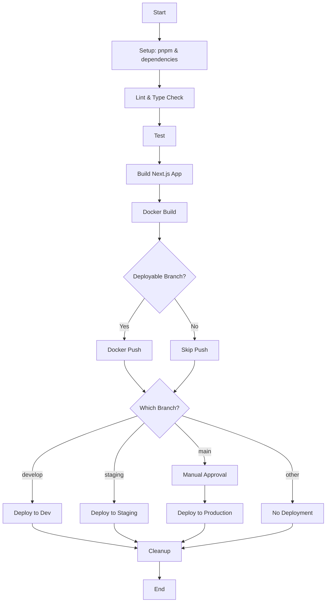

# Handoff for Alex 0.0.4: Jenkins Pipeline Implementation

## Project Goal
We have successfully implemented a Jenkins pipeline for the Next.js application using a containerized approach. The goal was to fix the build failures and create a complete CI/CD workflow for the Fireworks Sales application.

## Pipeline Structure



## What Has Been Accomplished

1. **Fixed Jenkins Configuration**:
   - Updated to use the `docker-agent-alpine` label that's working in our environment
   - Configured proper node context
   - Added Docker build and push stages

2. **Added Containerization**:
   - Created a Dockerfile to build our Next.js application in a multi-stage process
   - Added .dockerignore to optimize Docker builds
   - Configured proper environment variables and port exposing

3. **Updated Deployment Process**:
   - Enhanced deploy-dev.js script to handle Docker deployments
   - Set up the framework for environment-specific deployments

## File Changes Made

1. **Jenkinsfile**: Updated with proper agent configuration and added Docker build/push stages
2. **Dockerfile**: Created multi-stage build process for the Next.js application
3. **.dockerignore**: Added to optimize Docker build context
4. **scripts/deploy-dev.js**: Enhanced to support Docker-based deployments

## Standard Operating Procedure (SOP) for Alex 0.0.4

### 1. Configuration Requirements

Before running the pipeline, ensure the following is set up in Jenkins:

- Create a credential named `NEXT_PUBLIC_API_URL` with your API URL
- Create a credential named `DOCKER_REGISTRY_CREDENTIALS` with your Docker Hub or registry credentials
- Verify the 'docker-agent-alpine' label is correctly configured in Jenkins

### 2. Testing the Pipeline

1. Push the changes to the repository:
   ```bash
   git add Jenkinsfile Dockerfile .dockerignore scripts/deploy-dev.js
   git commit -m "Implement Docker-based CI/CD pipeline for Next.js app"
   git push origin <branch-name>
   ```

2. Monitor the Jenkins build at <your-jenkins-url>/job/fireworks-app/

3. Check for any errors in the Console Output, particularly in:
   - Setup stage (pnpm installation)
   - Docker Build stage (Docker daemon connectivity)
   - Docker Push stage (credentials and permissions)

### 3. Troubleshooting Common Issues

- **Docker connectivity**: If Docker build fails, check Docker daemon permissions for the Jenkins user
  ```bash
  sudo usermod -aG docker jenkins
  sudo systemctl restart jenkins
  ```

- **Node.js or pnpm issues**: If setup stage fails, ensure the agent has Node.js installed
  ```bash
  docker exec -it <jenkins-agent-container> sh
  node --version
  ```

- **Credential issues**: Verify credentials are correctly set in Jenkins Credentials store
  Navigate to Jenkins > Manage Jenkins > Credentials

### 4. Next Steps

1. **Enhance deployment scripts**:
   - Update scripts/deploy-staging.js and scripts/deploy-prod.js with similar Docker deployment logic
   - Use actual SSH commands when ready to deploy to real servers

2. **Add monitoring**:
   - Consider adding health checks after deployment
   - Implement rollback mechanisms for failed deployments

3. **Optimize build times**:
   - Add caching for pnpm modules
   - Implement parallel test execution for larger test suites

## Current Status

The pipeline is ready to be tested. We've fixed the agent label issues and implemented a containerized approach that should work with your Jenkins setup.

If you encounter any issues, check the Console Output in Jenkins for specific error messages and refer to the troubleshooting section above.
