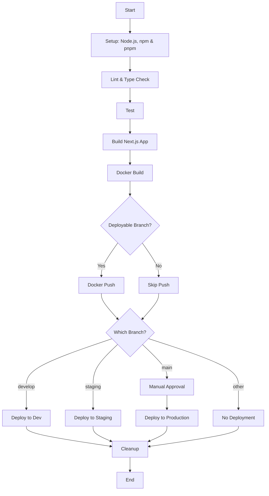

# Jenkins CI/CD: What's Working

## Current Status (as of March 4, 2025)

This document tracks the progress of our Jenkins CI/CD pipeline implementation for the Fireworks Sales application.

## Pipeline Components

## What's Working

1. ✅ Agent Configuration:
   - Successfully using the `docker-agent-alpine` label
   - Node context is properly set up

2. ✅ Docker Registry Authentication:
   - Docker credentials (`DOCKER_REGISTRY_CREDENTIALS`) have been set up correctly
   - Jenkins can now authenticate with Docker Hub

3. ✅ Post-build Cleanup:
   - Fixed the `cleanWs` step in the post section to run within a node context
   - Added error handling for Docker system prune command

## Latest Improvements

1. 🔄 Jenkins Agent Environment:
   - Added Alpine package manager commands to install Node.js and npm
   - Added Docker installation check and fallback installation
   - Enhanced debug output throughout the pipeline

2. 🔄 Docker Build Process:
   - Enhanced to use build arguments for environment variables
   - Updated Dockerfile to properly handle environment variables at both build and runtime
   - Added error handling for Docker commands

3. 🔄 Deployment Scripts:
   - Enhanced deployment scripts with proper environment variable handling
   - Implemented staging and production scripts with appropriate safety measures

## Known Issues

1. ❌ NEXT_PUBLIC_API_URL:
   - Missing credential in Jenkins
   - Pipeline requires this to be added as a secret text credential

2. ❌ Docker Connectivity:
   - The Docker daemon socket may not be mounted on the Jenkins agent
   - This would prevent Docker build/push operations from working properly

## Next Steps

1. Add the `NEXT_PUBLIC_API_URL` credential to Jenkins:
   - Create a secret text credential with the API URL (could be http://localhost:3000 for development)
   - Set the ID to "NEXT_PUBLIC_API_URL"

2. Configure Docker Socket on Jenkins Agent:
   - Ensure the Docker socket is mounted on the Jenkins agent
   - This might require updating the agent configuration or Docker daemon settings

3. Testing and Verification:
   - Push updated changes to the repository
   - Monitor Jenkins build for successful completion
   - Check logs for any new error messages

4. Future Enhancements:
   - Add caching for Node modules to speed up builds
   - Implement health checks after deployment
   - Create rollback mechanisms for failed deployments
