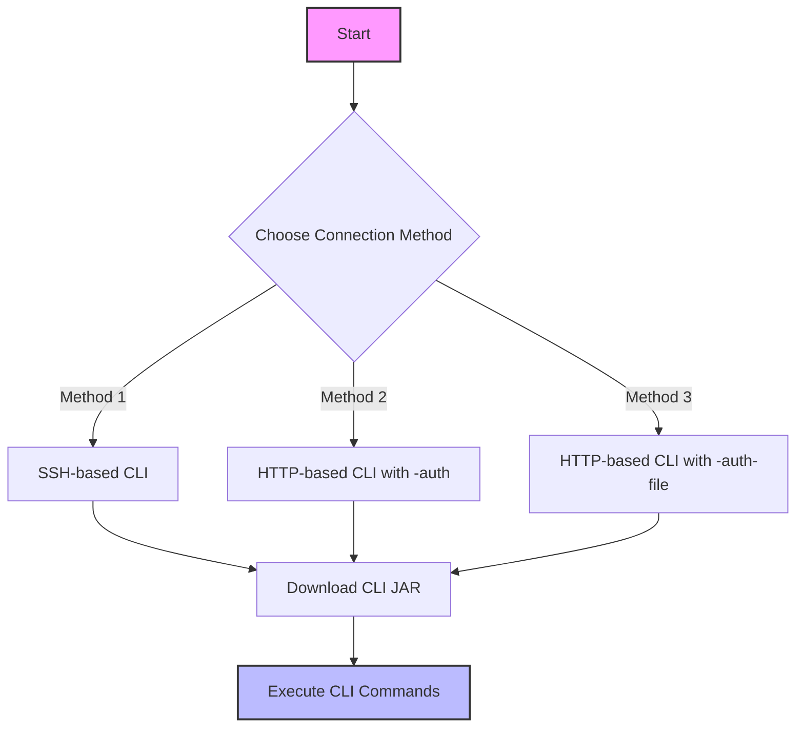
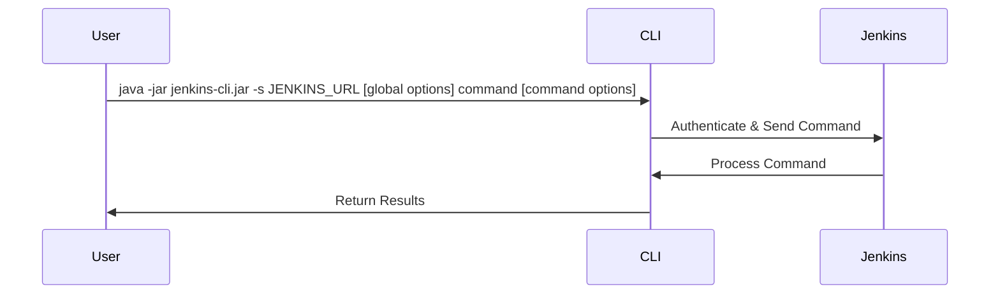
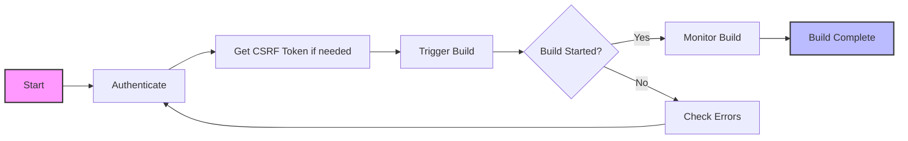
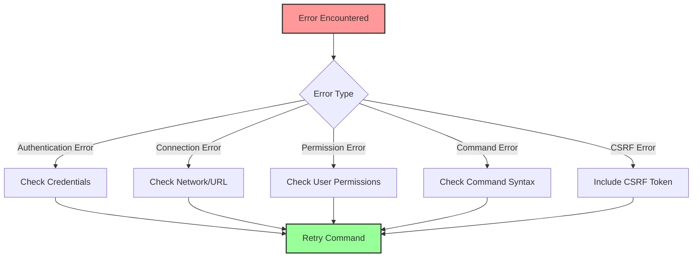
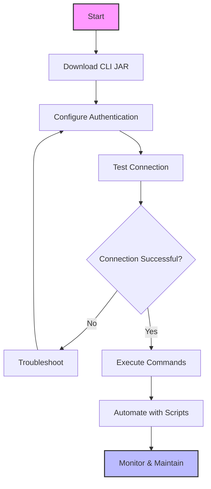
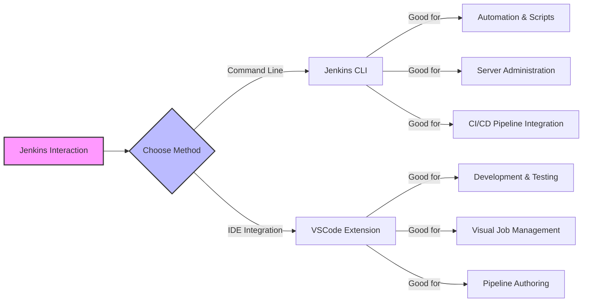

# Jenkins CLI Usage Guide

@https://www.jenkins.io/doc/book/managing/cli/

## Overview

This rule provides guidance on using the Jenkins Command Line Interface (CLI) effectively. The Jenkins CLI allows you to access Jenkins from a script or command line, providing a convenient way to interact with Jenkins programmatically.

## Installed Tools and Extensions

- **Jenkins Extension Pack for VSCode** - Comprehensive package of Jenkins tools for Visual Studio Code that provides pipeline syntax highlighting, job management, and other Jenkins-related features directly in the IDE.

## Authentication Methods

The Jenkins CLI supports several authentication methods:

1. **SSH Public Key Authentication** - Most secure method
2. **Username and API Token** - Good balance of security and convenience
3. **Username and Password** - Least secure, not recommended for production

## CLI Connection Methods



## Basic Usage Pattern



## Finding the CLI JAR

The Jenkins CLI JAR file is typically located at:
- `/var/jenkins_home/war/WEB-INF/jenkins-cli.jar` (Docker containers)
- `JENKINS_URL/jnlpJars/jenkins-cli.jar` (Direct download)

## Common Commands

1. **build** - Builds a job
2. **console** - Retrieves console output of a build
3. **who-am-i** - Reports your credential and permissions
4. **help** - Lists available commands or detailed help for a specific command
5. **install-plugin** - Installs a plugin
6. **safe-restart** - Safely restarts Jenkins

## Triggering a Build Process



## Example Commands

### SSH-based CLI
```bash
ssh -l username -p 2222 jenkins-server help
```

### HTTP-based CLI with username/password
```bash
java -jar jenkins-cli.jar -s http://jenkins-server:8080/ -auth username:password build job-name
```

### HTTP-based CLI with API token
```bash
java -jar jenkins-cli.jar -s http://jenkins-server:8080/ -auth username:apitoken who-am-i
```

## VSCode Integration

With the Jenkins Extension Pack installed in VSCode, you can:

1. **Manage Jenkins jobs** directly from the VSCode interface
2. **Validate Jenkinsfile syntax** without leaving your editor
3. **View build logs** in a dedicated panel
4. **Trigger builds** with a simple click
5. **Get autocompletion** for Jenkinsfile and Groovy syntax

This provides an alternative to using the CLI for many common tasks.

## Troubleshooting



## Best Practices

1. **Use API tokens instead of passwords** for better security
2. **Create dedicated service accounts** for automation
3. **Limit permissions** of CLI users to only what they need
4. **Use SSH authentication** when possible
5. **Store credentials securely** using credential files or environment variables
6. **Script common operations** for consistency and efficiency
7. **Leverage VSCode extensions** for improved developer experience

## Docker-specific Considerations

When using Jenkins in Docker:
1. The CLI JAR is typically at `/var/jenkins_home/war/WEB-INF/jenkins-cli.jar`
2. Use `docker exec` to run commands inside the container
3. Example: `docker exec jenkins-container java -jar /var/jenkins_home/war/WEB-INF/jenkins-cli.jar -s http://localhost:8080/ -auth username:password command`

## Complete CLI Workflow



## CLI vs VSCode Extension Workflow

