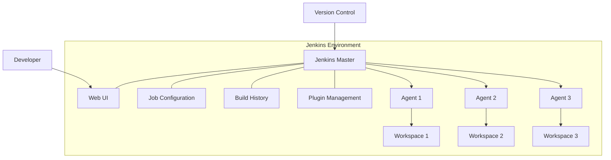
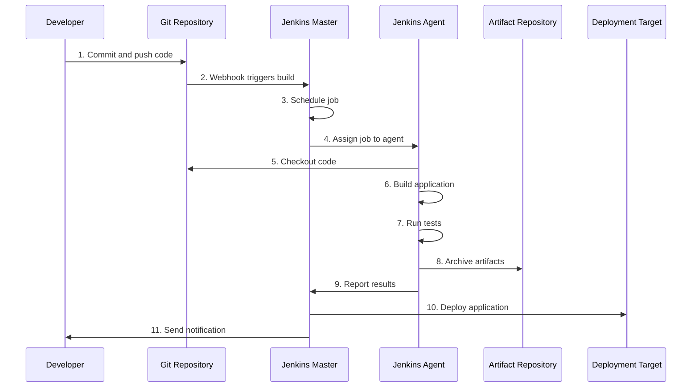
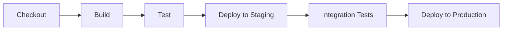

# Chapter 1: Introduction to Jenkins

## What is Jenkins? 🏗️

Jenkins is an open-source automation server that helps automate the parts of software development related to building, testing, and deploying, facilitating continuous integration and continuous delivery (CI/CD). It serves as the backbone of modern DevOps practices, allowing teams to implement automation in their development lifecycle.

Jenkins was originally developed as the Hudson project in 2004 and later renamed to Jenkins in 2011. Today, it's one of the most popular automation servers with thousands of plugins that extend its functionality.

### Key Benefits of Jenkins:

- **Free and Open Source**: No licensing costs
- **Extensible**: Vast ecosystem of plugins (2000+)
- **Community Support**: Large, active community
- **Platform Independent**: Runs on Windows, macOS, and various Linux distributions
- **Easy Configuration**: Web interface for setup and configuration
- **Distributed**: Can distribute work across multiple machines

## Jenkins Architecture 🏛️

Jenkins operates on a master-agent architecture:

### Master-Agent Architecture Diagram



### Components:

1. **Master Node**:
   - Schedules build jobs
   - Dispatches builds to agents
   - Monitors agents
   - Records and presents build results
   - Can also execute builds directly

2. **Agent Nodes**:
   - Execute build jobs dispatched by the master
   - Can be configured to have specific environments
   - Help distribute the build load
   - Can be dynamically provisioned (cloud agents)

## How Jenkins Works: The CI/CD Process Flow 🔄

Jenkins implements continuous integration and continuous delivery through an automated workflow:

### CI/CD Process Flow Diagram



### Detailed Process Explanation:

1. **Code Commit**: Developer commits code to a version control system (Git, SVN, etc.)
2. **Build Trigger**: Jenkins detects the change through polling or webhooks
3. **Job Scheduling**: Jenkins master schedules the build job
4. **Agent Assignment**: Job is assigned to an available agent
5. **Code Checkout**: Agent checks out the latest code
6. **Build Process**: Code is compiled, dependencies are resolved
7. **Testing**: Unit tests, integration tests, etc. are executed
8. **Artifact Creation**: Successful builds produce artifacts (JARs, WARs, Docker images)
9. **Result Reporting**: Test results and build status are reported
10. **Deployment**: Artifacts are deployed to target environments
11. **Notification**: Team is notified of build success/failure

## Key Components of Jenkins 🧩

Jenkins has several core components that work together to enable CI/CD:

### 1. Jobs/Projects

Jobs (or Projects) are the fundamental building blocks in Jenkins. They represent a task or step in your CI/CD process.

Types of Jobs:
- **Freestyle Projects**: Simple, single tasks
- **Pipeline Projects**: Complex, multi-stage workflows
- **Multi-configuration Projects**: Test across multiple environments
- **Folder**: Organize jobs hierarchically
- **Multibranch Pipeline**: Automatically create pipelines for branches

### 2. Builds

Builds are individual executions of jobs. Each build:
- Has a unique number
- Contains a specific state (success, failure, unstable)
- Includes console output
- Stores artifacts and test results

### 3. Plugins

Plugins extend Jenkins functionality. Common categories include:
- **Source Code Management**: Git, SVN, Mercurial
- **Build Tools**: Maven, Gradle, npm
- **Testing**: JUnit, TestNG, Selenium
- **Notification**: Email, Slack, Teams
- **Deployment**: Docker, Kubernetes, AWS
- **UI**: Blue Ocean, Dashboard View

### 4. Pipeline

Pipeline is a suite of plugins that supports implementing and integrating continuous delivery pipelines into Jenkins.



### 5. Jenkinsfile

A Jenkinsfile is a text file that contains the definition of a Jenkins Pipeline and is checked into source control.

### 6. Workspace

The workspace is a directory on the agent where Jenkins builds your project:
- Contains the checked-out code
- Where the build and tests run
- Cleaned up based on configuration

### 7. Artifacts

Artifacts are the outputs produced by builds that you want to keep:
- Compiled applications (.jar, .war, etc.)
- Documentation
- Test reports
- Docker images

## Jenkins Pipeline Example 📝

Here's a simple Jenkinsfile example that demonstrates a basic CI/CD pipeline:

```groovy
pipeline {
    agent any
    
    stages {
        stage('Checkout') {
            steps {
                // Get code from a GitHub repository
                git 'https://github.com/your-username/your-repo.git'
            }
        }
        stage('Build') {
            steps {
                echo 'Building the application...'
                // Example: Maven build
                sh 'mvn clean compile'
            }
        }
        stage('Test') {
            steps {
                echo 'Running tests...'
                // Example: Run Maven tests
                sh 'mvn test'
                // Archive test results
                junit '**/target/surefire-reports/TEST-*.xml'
            }
        }
        stage('Package') {
            steps {
                echo 'Packaging the application...'
                // Example: Create JAR file
                sh 'mvn package'
                // Archive the artifacts
                archiveArtifacts artifacts: 'target/*.jar', fingerprint: true
            }
        }
        stage('Deploy') {
            steps {
                echo 'Deploying the application...'
                // Example deployment step
                sh 'echo "Deploying to production server..."'
            }
        }
    }
    
    post {
        success {
            echo 'Pipeline completed successfully!'
            // Send notifications on success
            emailext (
                subject: "Build Successful: ${currentBuild.fullDisplayName}",
                body: "The build was successful. Check: ${env.BUILD_URL}",
                to: 'team@example.com'
            )
        }
        failure {
            echo 'Pipeline failed!'
            // Send notifications on failure
            emailext (
                subject: "Build Failed: ${currentBuild.fullDisplayName}",
                body: "The build failed. Check: ${env.BUILD_URL}",
                to: 'team@example.com'
            )
        }
    }
}
```

## Real-World Use Cases 🌍

### 1. Automated Testing

**Example**: Netflix uses Jenkins to run thousands of automated tests whenever code changes are made.

**Benefits**:
- Immediate feedback on code quality
- Prevents bugs from reaching production
- Enables faster development cycles

**Implementation**:
```groovy
stage('Test') {
    parallel {
        stage('Unit Tests') {
            steps {
                sh 'npm run test:unit'
            }
        }
        stage('Integration Tests') {
            steps {
                sh 'npm run test:integration'
            }
        }
        stage('UI Tests') {
            steps {
                sh 'npm run test:ui'
            }
        }
    }
}
```

### 2. Deployment Automation

**Example**: Amazon uses Jenkins to automate deployments across thousands of servers.

**Benefits**:
- Reduces manual errors
- Decreases deployment time from days to minutes
- Enables easy rollbacks

**Implementation**:
```groovy
stage('Deploy') {
    steps {
        // Deploy to staging first
        sh 'aws elasticbeanstalk update-environment --environment-name staging --version-label $BUILD_NUMBER'
        
        // Wait for approval
        input message: 'Deploy to production?', ok: 'Yes'
        
        // Deploy to production
        sh 'aws elasticbeanstalk update-environment --environment-name production --version-label $BUILD_NUMBER'
    }
}
```

### 3. Infrastructure as Code

**Example**: DevOps teams use Jenkins to automatically provision and configure cloud resources.

**Benefits**:
- Consistent environments
- Version-controlled infrastructure
- Automated scaling

**Implementation**:
```groovy
stage('Provision Infrastructure') {
    steps {
        // Use Terraform to provision infrastructure
        sh 'terraform init'
        sh 'terraform plan -out=tfplan'
        sh 'terraform apply -auto-approve tfplan'
    }
}
```

### 4. Continuous Feedback

**Example**: Development teams set up Jenkins to notify them via Slack when builds fail.

**Benefits**:
- Immediate awareness of issues
- Faster resolution times
- Better team collaboration

**Implementation**:
```groovy
post {
    success {
        slackSend channel: '#builds', 
                  color: 'good', 
                  message: "Build Successful: ${env.JOB_NAME} #${env.BUILD_NUMBER}"
    }
    failure {
        slackSend channel: '#builds', 
                  color: 'danger', 
                  message: "Build Failed: ${env.JOB_NAME} #${env.BUILD_NUMBER}"
    }
}
```

### 5. Security Scanning

**Example**: Security teams integrate tools like OWASP ZAP with Jenkins to automatically scan code for vulnerabilities.

**Benefits**:
- Early detection of security issues
- Compliance with security standards
- Reduced security risks

**Implementation**:
```groovy
stage('Security Scan') {
    steps {
        // Run OWASP Dependency Check
        sh 'dependency-check --project "My App" --scan ./app --format XML'
        
        // Publish results
        dependencyCheckPublisher pattern: '**/dependency-check-report.xml'
    }
}
```

## Getting Started with Jenkins 🚀

To start using Jenkins:

1. **Installation**: Install Jenkins on a server or local machine
2. **Initial Setup**: Complete the setup wizard and install recommended plugins
3. **Create a Job**: Set up your first build job
4. **Configure Build Triggers**: Set up how builds are triggered
5. **Add Build Steps**: Define what happens during the build
6. **Configure Post-Build Actions**: Define what happens after the build

## Quiz: Chapter 1 - Jenkins Basics

1. What is Jenkins primarily used for?
2. Name the two main components in Jenkins' architecture.
3. What is a Jenkinsfile and where is it typically stored?
4. Name at least three key components of Jenkins.
5. How does Jenkins typically get notified about code changes?
6. What is a Jenkins pipeline?
7. In a typical CI/CD workflow, what happens after tests pass?
8. What are Jenkins agents responsible for?
9. Name one real-world benefit of using Jenkins for deployment.
10. What type of architecture does Jenkins use (master-slave, peer-to-peer, etc.)?

## Additional Resources 📚

- [Official Jenkins Documentation](https://www.jenkins.io/doc/)
- [Jenkins Pipeline Syntax Reference](https://www.jenkins.io/doc/book/pipeline/syntax/)
- [Jenkins Community Plugins](https://plugins.jenkins.io/)
