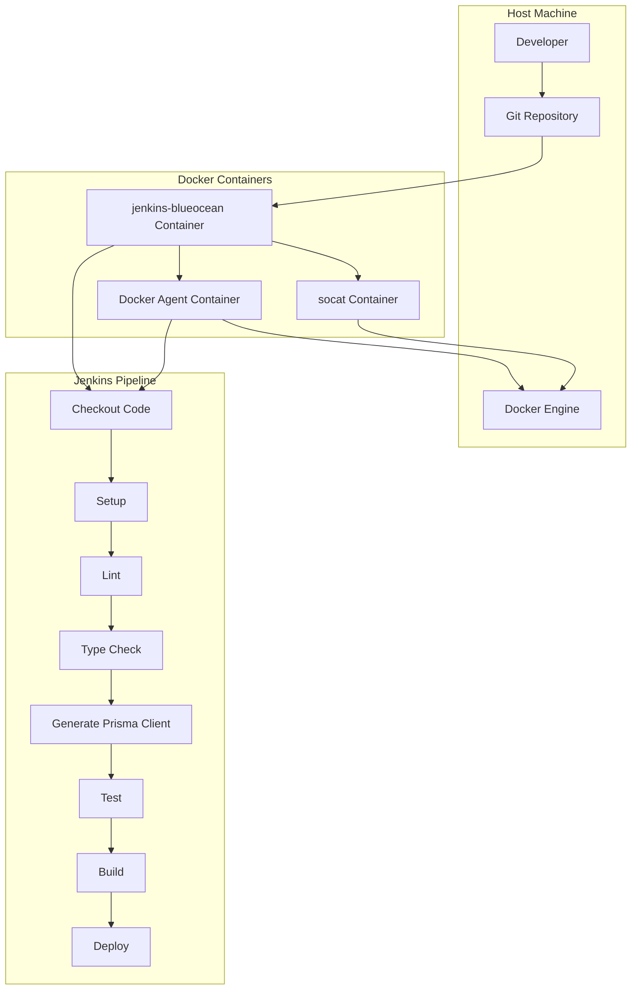
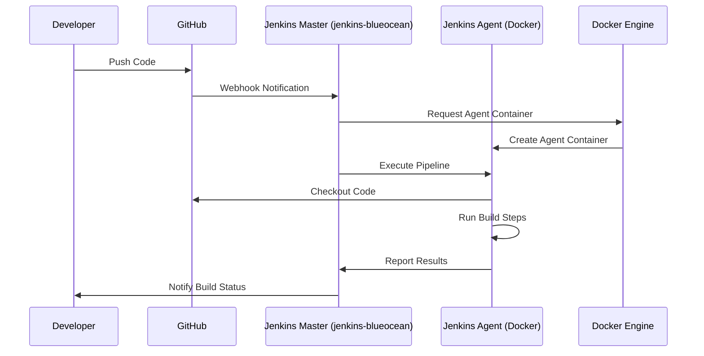
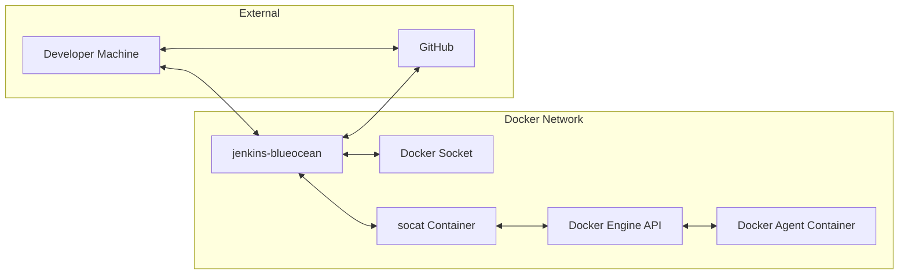
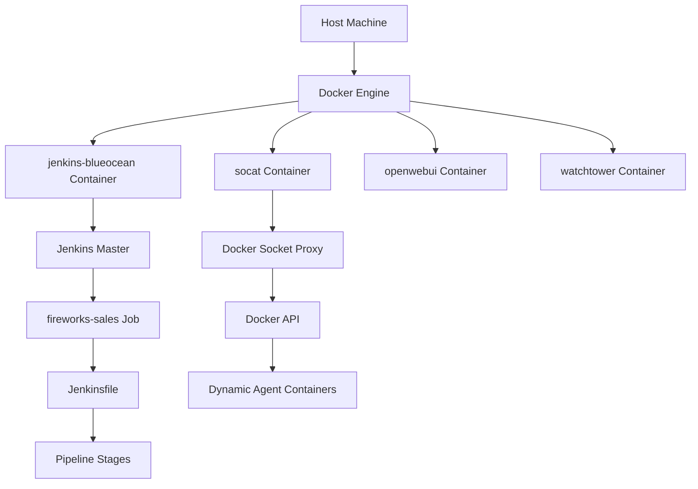
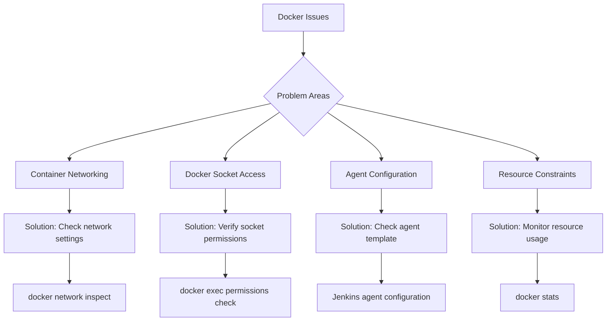
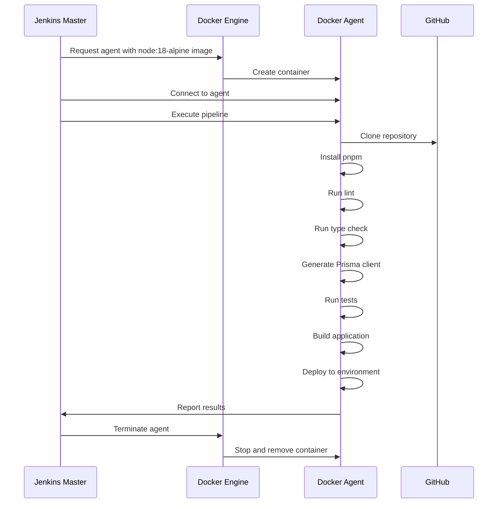
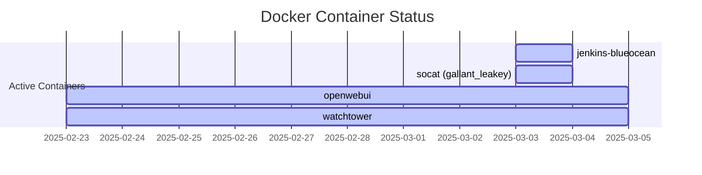

# Jenkins CI/CD with Docker Workflow

This document provides a visual representation of how Jenkins interacts with Docker in our CI/CD pipeline for the Fireworks Sales application.

## Architecture Overview

## Container Interaction Diagram

## Docker Network Configuration

## Current Setup Analysis

Based on our investigation, here's how your current Docker setup is configured:

## Troubleshooting Docker Issues

If your Jenkins pipeline is not working properly with Docker, consider the following issues:

## Docker Agent Workflow

The following diagram shows how Jenkins uses Docker agents to execute pipeline stages:

## Current Docker Container Status

Based on our investigation, these are the Docker containers currently running in your environment:

## Recommendations for Docker Setup

To ensure your Jenkins pipeline works correctly with Docker, consider the following recommendations:

1. **Container Communication**:
   - Ensure all containers are on the same Docker network
   - Verify that the Jenkins container can communicate with the Docker socket

2. **Docker Socket Access**:
   - Check that the socat container is properly forwarding Docker socket connections
   - Verify that the Jenkins container has the necessary permissions

3. **Agent Configuration**:
   - Confirm that the Docker agent template is correctly configured
   - Ensure the agent has access to the necessary resources

4. **Resource Monitoring**:
   - Monitor container resource usage to ensure there are no constraints
   - Check for any container logs indicating resource issues

By following these recommendations, you should be able to resolve any Docker-related issues with your Jenkins pipeline. 