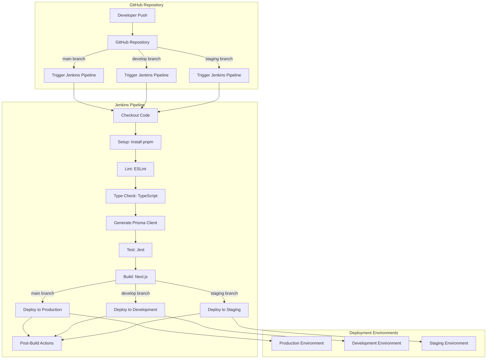
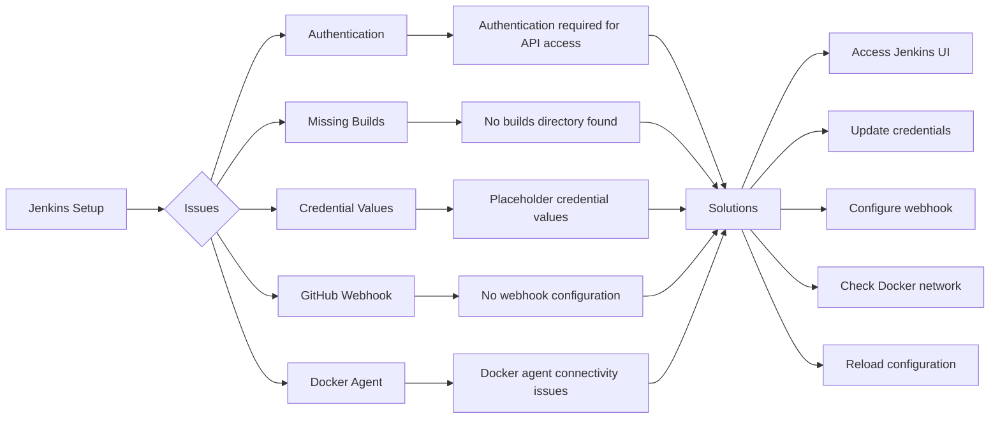

# Jenkins CI/CD Pipeline Workflow

This document provides a visual representation of our Jenkins CI/CD pipeline workflow for the Fireworks Sales application, along with an analysis of potential issues in the current setup.

## Pipeline Workflow Diagram

## Current Setup Analysis

Based on the investigation of your Jenkins setup, here's an analysis of the current state and potential issues:

### Working Components

1. **Jenkins Container**: The `jenkins-blueocean` container is running properly on port 8080.
2. **Job Configuration**: The `fireworks-sales` job is configured to monitor your GitHub repository.
3. **Branch Configuration**: The job is set up to watch the `main`, `develop`, and `staging` branches.
4. **Pipeline Definition**: The job is looking for a Jenkinsfile in the root of your repository.
5. **Credentials Structure**: The necessary credential placeholders are defined in credentials.groovy.

### Potential Issues

## Troubleshooting Steps

1. **Authentication Issues**:
   - Access the Jenkins web interface at http://localhost:8080/
   - Log in with your "mark" user credentials
   - If you've forgotten your password, you may need to reset it

2. **Missing Builds**:
   - The builds directory was not found, indicating no builds have run yet
   - Manually trigger a build from the Jenkins UI
   - Check console output for errors

3. **Credential Values**:
   - Replace placeholder values in credentials with actual values:
     - next-public-api-url
     - dev-database-url
     - staging-database-url
     - production-database-url

4. **GitHub Webhook Configuration**:
   - Set up a webhook in your GitHub repository
   - Point it to http://your-jenkins-url/github-webhook/
   - Select the "Push" event

5. **Docker Agent Connectivity**:
   - Check if the Docker agent can connect to your repository
   - Verify network settings between Jenkins and Docker
   - Check if the Docker agent has the necessary permissions

## Next Steps

1. Access the Jenkins web interface
2. Verify the job configuration
3. Update credentials with actual values
4. Manually trigger a build
5. Monitor the build process
6. Set up GitHub webhooks for automatic builds
7. Configure notifications for build results

By following these steps, you should be able to resolve the issues with your Jenkins pipeline and get it working properly. 