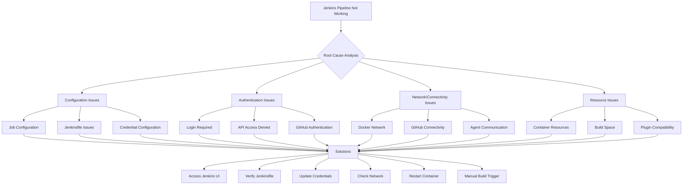
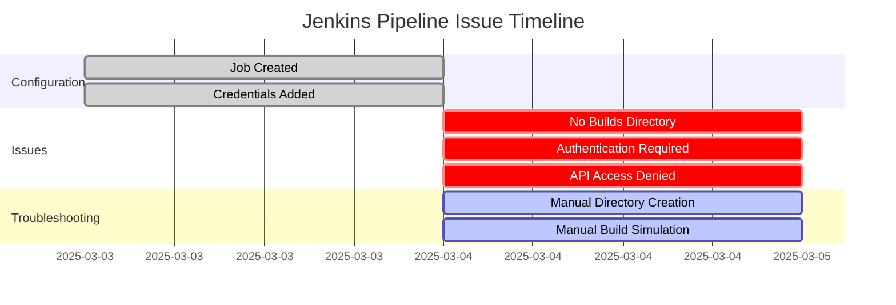
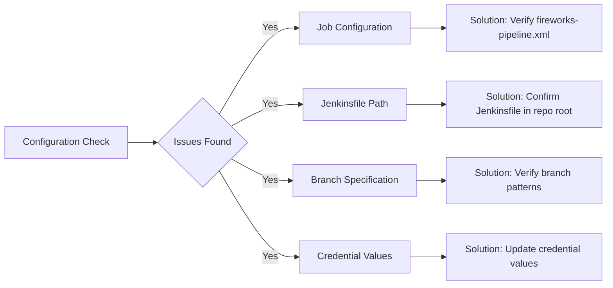
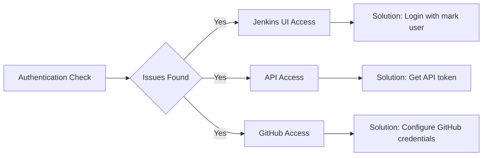
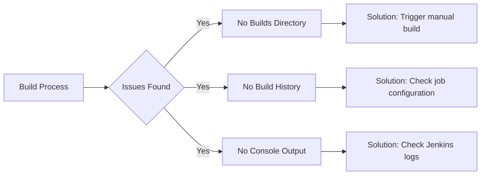

# Jenkins Pipeline Troubleshooting Guide

This document provides a visual representation of the troubleshooting process for the Jenkins CI/CD pipeline issues in the Fireworks Sales application.

## Current Pipeline Status

Based on our investigation, the Jenkins pipeline for the Fireworks Sales application is configured but not executing builds. This guide will help identify and resolve the issues.

## Issue Identification Flowchart



## Observed Symptoms

From our command-line investigation, we've observed the following symptoms:



## Detailed Diagnosis

### 1. Configuration Check



### 2. Authentication Check



### 3. Build Process Check



## Step-by-Step Resolution

1. **Access Jenkins UI**:
   - Navigate to http://localhost:8080/
   - Login with your "mark" user credentials

2. **Verify Job Configuration**:
   - Check that the job is pointing to the correct GitHub repository
   - Verify that the Jenkinsfile path is correct (should be in the root)
   - Confirm branch specifications are correct (main, develop, staging)

3. **Update Credentials**:
   - Navigate to Manage Jenkins > Manage Credentials
   - Update the placeholder values with actual values:
     - next-public-api-url
     - dev-database-url
     - staging-database-url
     - production-database-url

4. **Trigger Manual Build**:
   - Navigate to the fireworks-sales job
   - Click "Build Now" to manually trigger a build
   - Monitor the console output for errors

5. **Configure GitHub Webhook**:
   - In your GitHub repository, go to Settings > Webhooks
   - Add a new webhook pointing to http://your-jenkins-url/github-webhook/
   - Select the "Push" event

6. **Check Docker Network**:
   - Verify that the Jenkins container can communicate with the Docker agent
   - Check that the Docker agent can access GitHub

7. **Restart Jenkins**:
   - If all else fails, try restarting the Jenkins container:
   ```bash
   docker restart jenkins-blueocean
   ```

By following these steps systematically, you should be able to identify and resolve the issues with your Jenkins pipeline. 